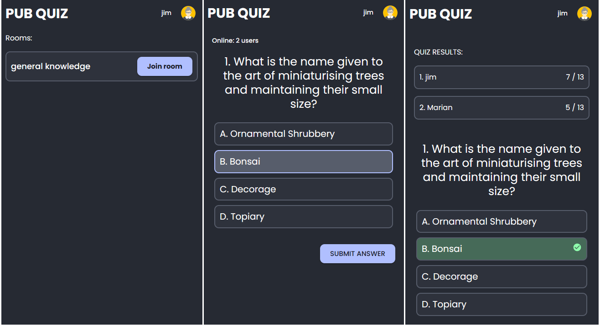

# PUB QUIZ APP

### Backend repository

- [https://github.com/mhaprean/pub-quiz-backend/](https://github.com/mhaprean/pub-quiz-backend/)

### Live site

- [https://pubquizapp.netlify.app/](https://pubquizapp.netlify.app/)

## Description

- Pub Quiz is a web-based application designed for hosting pub quizzes. It features two user roles - "User" and "Host."

- As a Host, you have the ability to create quizzes by choosing a title, category, difficulty, and adding questions. You can then create a room, choose a room title, and pick an existing quiz from your list. A four-digit password is automatically generated upon room creation, and the Host is automatically added to the room.
- On the Host's screen, you can see the room password, the total number of online participants, and a "START QUIZ" button.
- The Host can project the screen on a video projector for everyone in the pub to participate. After pressing the "START QUIZ" button, the first question will appear on the screen, along with the possible answers. The Host will read the question aloud through a microphone.
- The Host cannot select the questions, they are only responsible for pressing the "Next" button to display the next question.

- As a User, you will need to use your phone, register or log in to see a list of available rooms. You can then join a room by entering the room password and becoming a participant. You will see the questions and possible answers on the screen, as well as a "SUBMIT ANSWER" button. Once you submit an answer, you cannot change your mind.

- When the quiz ends, both Users and Hosts will see the scores of each participant.

- The prizes for the winners can be decided by each pub

### Screenshots

